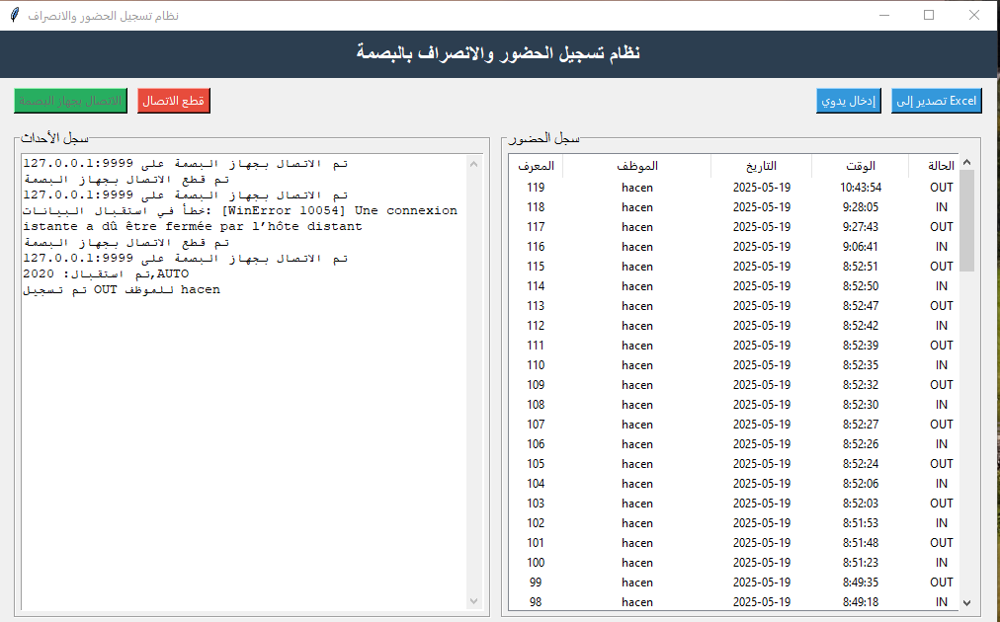
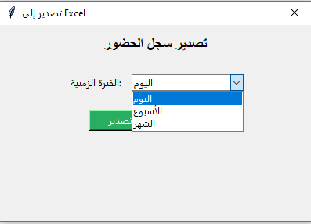
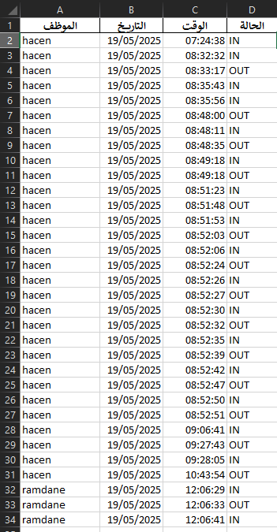
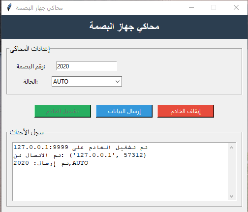
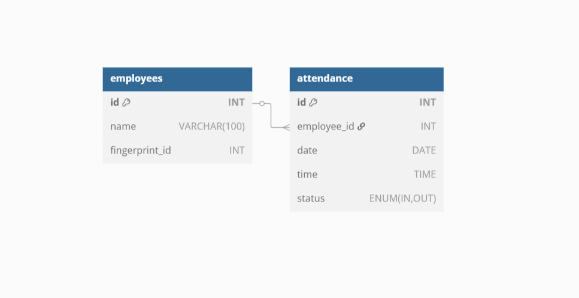

# attendance_recorder_fingerprint

This project is an integrated attendance and departure tracking system using fingerprint recognition, consisting of two main components:

1- Attendance and Departure Management System: The main application for managing employee attendance.

2- Fingerprint Device Simulator: A tool to simulate a fingerprint device for testing and development purposes.

---

## Screenshots

### 1. Attendance and Departure Management System

*Description: Main interface showing employee attendance records.*

### 2.Export Data to Excel:
The system includes a button that allows exporting attendance data to an Excel file. The information is organized based on check-in or check-out status, and the user can choose a specific time period (day, week, or month). This feature facilitates efficient analysis and tracking of employee attendance.

 
---

### 3. Fingerprint Device Simulator

*Description: Simulator interface for testing fingerprint devices.*

### 4.la base de donnée
*This project uses a MySQL database to manage employee attendance with two tables: **employees** and **attendance**. XAMPP is used to host the MySQL server locally. The Python app connects to the database using mysql.connector.*

CREATE TABLE **employees** (
    id INT PRIMARY KEY AUTO_INCREMENT,
    name VARCHAR(100),
    fingerprint_id INT UNIQUE
);

CREATE TABLE **attendance** (
    id INT PRIMARY KEY AUTO_INCREMENT,
    employee_id INT,
    date DATE,
    time TIME,
    status ENUM('IN', 'OUT'),
    FOREIGN KEY (employee_id) REFERENCES employees(id)
);

